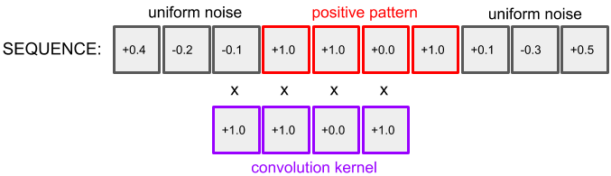
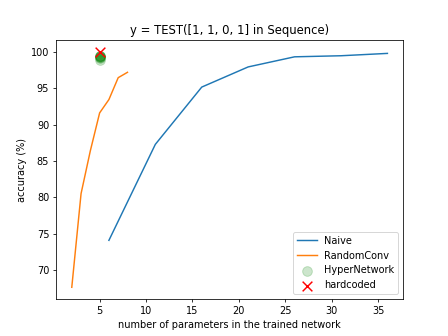
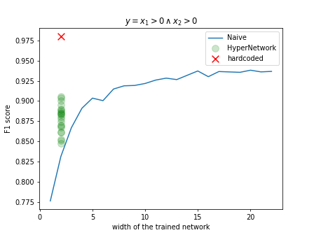
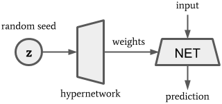

I'm sharing here some experiments with small overparameterized models. 

- My first experiment shows that, to perfectly recognize the pattern `1101`, an SGD-trained CNN with max pooling requires more filters than otherwise expected. The more it is overparameterized, the better it performs.
- I reach a similar conclusion from my second experiment wherein a 2-layer perceptron is trained to predict the output of this simple boolean expression: `y = x1 > 0 AND x2 > 0`.

This leads me to speculate that over-parameterization plays an important role in enabling neural networks to explore the parameter space. Roughly speaking, `over-parameterization => exploration`. From this perspective, one can draw a parallel between over-parameterization and global optimization techniques, such as evolutionary algorithms and [PSO](https://en.wikipedia.org/wiki/Particle_swarm_optimization), in that they aim at finding the global minimum by getting multiple solution candidates to explore the loss landscape.

# Max pooling

In this experiment, we train a 1d convolution layer to predict whether the sub-sequence `[1, 1, 0, 1]` is included in a given sequence of 64 random floats. The random floats are sampled from a uniform distribution in the range `[-0.5, 0.5]` so there is no room for ambiguity. The 4-parameter kernel `w=[1.0, 1.0, 0.0, 1.0]` is among the many kernels that perfectly solve that problem, yet an SGD-trained 4-parameter convolution layer may fail to converge to a satisfactory solution if its initial weights were to start too far from a global optimum.

<p align="center">
  
</p>

Here is the Pytorch go-to solution to this problem.

```python3
class NaiveCNN(nn.Module):
    def __init__(self, n_filters: int) -> None:
        super(NaiveCNN, self).__init__()
        self._conv = nn.Conv1d(in_channels=1, out_channels=n_filters, kernel_size=4, bias=False)
        self._decision = nn.Linear(n_filters, 1)

    def forward(self, x: torch.Tensor, seed: torch.Tensor) -> torch.Tensor:
        conved = self._conv(x).max(dim=2)[0]
        return self._decision(conved)
```

### Evaluation

<p align="center">
  
</p>


RandomConv refers to the same architecture as Naive except that the convolution kernels are frozen such that all the hard work is done by the `_decision` layer. As `_decision` utilizes only one parameter per filter, while `Conv1d` utilizes 4 times as many, RandomConv is far more economical than Naive.

HyperNetworks are briefly explained in the 'discussion' section.

# BoolNet

This time the problem is even more straightforward. It is that of predicting whether both inputs of the network are positive. It can be readily solved by the following architecture.

```python3
net = nn.Sequential(
            nn.Linear(2, width),
            nn.ReLU(),
            nn.Linear(width, 1)
)
```

This hard-coded solution hits almost 100% accuracy with `width=2`:

```python3
def hardcoded(inp):
   a = nn.ReLU(-inp[:, 0])
   b = nn.ReLU(-inp[:, 1])
   return -100*a -100*b + 10
```

### Evaluation

<p align="center">
  
</p>


We observe that over-parameterizing with `width > 2` is beneficial.

# Discussion

Gradient descent is not good at exploration. For one thing, in its basic form, there is only one candidate solution and it often ends up falling into a local minimum. Another hassle for gradient descent is the possible lack of proper backprop flow at particular values of the parameters. Both ReLU and max pooling cut the gradient flow for certain configurations of the input. While it is relatively easy to replace ReLU activations with more gradient-friendly functions, max pooling lacks alternatives.

There exist several optimization tricks to overcome those hassles, among which gradient momentum, smooth activation functions and various uses of randomness. As a matter of fact, I have managed to train NaiveCNN and NaiveBoolNet with less parameters thanks to other PyTorch built-in optimizers. Nevertheless, I believe we underestimate over-parameterization as an exploration device. There has been [research on the effect of over-parameterization on the optimization dynamics](https://openreview.net/pdf?id=S1lPShAqFm), which could explain the success of deep learning, but it hasn't been explicitly framed as a way of coping with gradient descent's lack of exploration mechanism.

Lastly, I propose a hypernetwork architecture that reaches high accuracy while generating networks with fewer parameters than conventional networks, using vanilla SGD and without changing the architectural constraints placed on the solution, e.g. ReLU and max pooling. The hypernetwork itself may take advantage of over-parameterization and smooth activation functions, but it is irrelevant to the constructed network, which is less likely to overfit than if it were trained in an over-parameterized regime.

<p align="center">
  
</p>

The main idea is to generate hypotheses from a random seed. The hypernetwork fulfills the task of exploring multiple candidate solutions in parallel, though I am not sure whether it is a competitive alternative to known ways of incorporating randomness/noise into the optimization process. 


# Reproducing the results

```bash
> python3 eval_cnn.py
> python3 eval_bool.py
```

```bash
> cat requirements.txt
torch==1.5.1
tqdm==4.46.1
numpy==1.19.1
matplotlib==3.2.2
```
